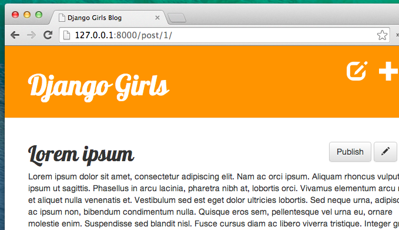

# Tarea: ¡Mejora tu sitio web!

Nuestro blog ha llegado muy lejos pero todavía tiene capacidad de mejora. Lo siguiente que haremos será añadir la funcionalidad de tener borradores de entradas y publicarlos. También añadiremos el borrado de entradas que ya no queremos. ¡Genial!


## Guardar nuevas entradas como borradores

Por ahora, cuando creamos entradas nuevas usando nuestro formulario *New post* la entrada se publica directamente. Para que se guarde como borrador en vez de publicarse **borra** la siguiente línea del método `post_new` en el archivo `blog/views.py`: 

```python
post.published_date = timezone.now()
```

De esta manera, las nuevas entradas serán guardadas como borradores que podemos revisar más tarde en vez de ser publicadas instantáneamente. Todo lo que necesitamos ahora es una manera de listar y publicar borradores, ¡vamos a ello!

## Página con el listado de entradas no publicadas

¿Recuerdas el capítulo de *querysets*? Habíamos creado una vista `post_list` que enseñaba solo las entradas publicadas (aquellas que no tienen una fecha de publicación `published_date` vacía). 

Es hora de hacer algo similar, pero para borradores de entradas.

Añadamos un link en `blog/templates/blog/base.html` cerca del botón para añadir nuevas entradas (justo encima de la línea `<h1><a href="/">Django Girls Blog</a></h1>`):

```django
<a href="" class="top-menu"><span class="glyphicon glyphicon-edit"></span></a>
```

Y ahora: ¡urls! En `blog/urls.py` añadimos:

```python
url(r'^drafts/$', views.post_draft_list, name='post_draft_list'),
```

Es hora de crear una vista en `blog/views.py`:

```python
def post_draft_list(request):
    posts = Post.objects.filter(published_date__isnull=True).order_by('created_date')
    return render(request, 'blog/post_draft_list.html', {'posts': posts})
```

Esta línea `Post.objects.filter(published_date__isnull=True).order_by('created_date')` se asegura de que tomamos solo entradas no publicadas (`published_date__isnull=True`) y las ordena por fecha de creación (`order_by('created_date')`).

Ok, la última pieza que nos queda, es por supuesto ¡un *template*! Crea un archivo `blog/templates/blog/post_draft_list.html` y añade lo siguiente:

```django



    
        <div class="post">
            <p class="date">creado: {{ post.created_date|date:'d-m-Y' }}</p>
            <h1><a href="">{{ post.title }}</a></h1>
            <p>{{ post.text|truncatechars:200 }}</p>
        </div>
    

```

Se parece mucho a nuestro `post_list.html`, ¿verdad?

Ahora cuando vayas a `http://127.0.0.1:8000/drafts/` verás la lista de entradas no publicadas.

¡Sí! ¡Tu primera tarea finalizada!

## Añadir el botón de publicar

Sería bueno tener un botón en la página de detalle de las entradas del blog que inmediatamente publicase la entrada, ¿verdad?

Abramos `blog/template/blog/post_detail.html` y cambiemos estas líneas:

```django

    {{ post.published_date }}

```

por éstas:

```django

    {{ post.published_date }}

    <a class="btn btn-default" href="">Publicar</a>

```

Cómo te habrás dado cuenta, hemos añadido la línea `` aquí. Lo que significa que si la condición `` no se cumple (es decir, no hay fecha de publicación), entonces queremos ejecutar la línea `<a class="btn btn-default" href="">Publicar</a>`. Fíjate que estamos pasando una variable `pk` en ``.

Es hora de crear una URL (en `blog/urls.py`):

```python
url(r'^post/(?P<pk>[0-9]+)/publish/$', views.post_publish, name='post_publish'),
```

y finalmente, una *vista* (como siempre, en `blog/views.py`):

```python
def post_publish(request, pk):
    post = get_object_or_404(Post, pk=pk)
    post.publish()
    return redirect('blog.views.post_detail', pk=pk)
```

Recuerda, cuando creamos un modelo `Post` escribimos un método `publish`, que era algo así:

```python
def publish(self):
    self.published_date = timezone.now()
    self.save()
```

¡Ahora podemos usarlo al fin!

¡Y una vez más después de publicar la entrada se nos redirige inmediatamente a la página `post_detail`!  



¡Felicidades! Casi lo has conseguido. ¡El último paso es añadir el botón de borrado!

## Borrar una entrada

Abramos el archivo `blog/templates/blog/post_detail.html` una vez más y añadamos esta línea:

```django
<a class="btn btn-default" href=""><span class="glyphicon glyphicon-remove"></span></a>
```

justo debajo de la línea con el botón de editar.

Ahora necesitamos una URL (`blog/urls.py`):

```python
url(r'^post/(?P<pk>[0-9]+)/remove/$', views.post_remove, name='post_remove'),
```

Ahora, ¡es el momento de una vista! Abramos `blog/views.py` y añadamos este código:

```python
def post_remove(request, pk):
    post = get_object_or_404(Post, pk=pk)
    post.delete()
    return redirect('blog.views.post_list')
```

El único cambio es, de hecho, borrar una entrada del blog. Cada modelo Django puede ser borrado con `.delete()`. ¡Es tan simple como eso!

Y esta vez, después de borrar una entrada queremos ir a la página con la lista de entradas, así que usamos `redirect`.

¡Probémoslo! Ve a la página de una entrada e ¡intenta borrarla!


Sí, ¡esto es lo último! ¡Has completado este tutorial! ¡Eres increíble!
